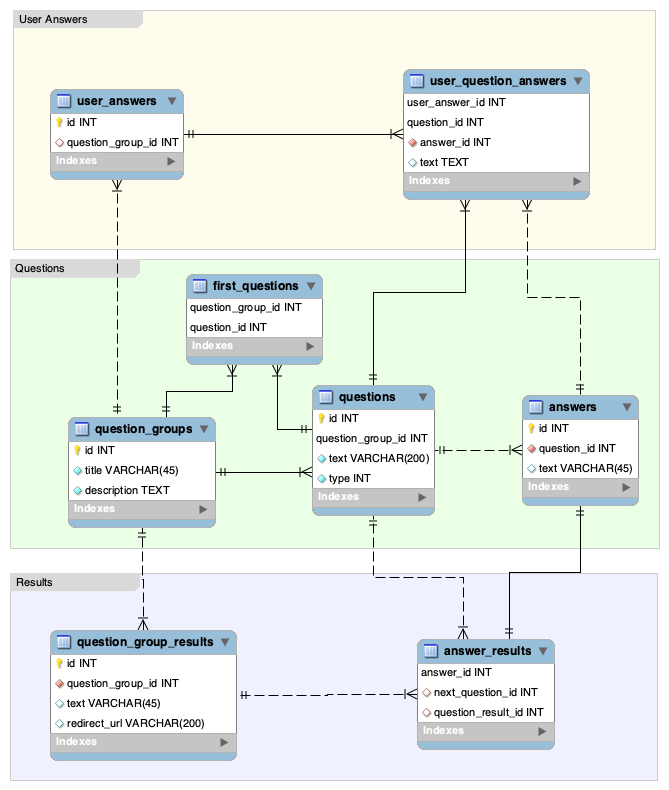
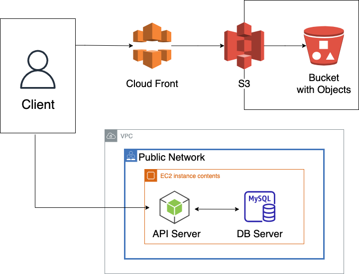

# Dassai Server

サポーターズ技育 CAMP 2022 4 月ハッカソン作品

診断アプリのサーバーサイド

アンケートアプリのバックエンドとしても使用可能

# ドキュメント

- [API ドキュメント](./doc/api.md)
- [オブジェクト定義](./doc/object.md)

# 起動方法

```
docker-compose up --build -d
```

## api サーバー単体

`/web-api` 内で下記コマンドを実行
```
npm install -D
npm start
```

# AWSへのデプロイ
`/cdk` 内で下記コマンドを実行
```
npm install -D
npm cdk deploy --all
```
※デプロイ後EC2インスタンスが起動状態になるので注意

その後ec2内でこのリポジトリをクローン & 起動

# DB



# ネットワーク

